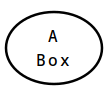

ASCII Diagram Converter
=======================

Facilitates the creation of technical diagrams using ASCII art.

* [Usage](#usage)
* [Diagram Format](#diagram-format)
* [Feedback](#feedback)
* [Credits and Licence](#credits-and-licence)


Usage
-----

`asciidi [options] [file]`


### Positional Arguments ###

`file`

Path to the input file to read. Use `-` to read from standard input. This is 
the default.


### Options ###

`-o, --outfile`

Path to the output file to write. Use `-` to write to standard output. This is 
the default if reading from standard input, otherwise defaults to 
`<input-file-name>.<output-extension>`.

`-f, --foreground`

The foreground colour, as comma-separated RGB values between 0 and 1. Some 
basic predefined colour names are also supported ("black", "red", "blue", etc).
Defaults to black.

`-b --background`

The background colour, as comma-separated RGB values between 0 and 1. Some
basic predefined colour names are also supported ("black", "red", "blue", etc).
Defaults to white.

`-c, --charheight`

The height to render each character as, in pixels. This will affect the overall
width and height of the output. Defaults to 24.

`-t --type`

The output format. Options are as follows:

* `svg` - Scalable Vector Graphics format. An XML document describing the 
  diagram as a set of shape-drawing instructions.
* `png` - PNG format. A losslessly-compressed raster image format.

Defaults to `png`.

`-q, --quiet`

If specified, causes informational output to be suppressed. Note that such 
output is omitted anyway when writing the diagram to standard output.


### Examples ###

Convert the ASCII diagram `diagram.txt` to a PNG image:

	$ asciidi diagram.txt
	

Convert diagram `foobar.txt` to the SVG file `result.svg`:

	$ asciidi -o result.svg foobar.txt
	

Convert the output of `mycommand` to an SVG file called `output`:

	$ mycommand | asciidi -o output -t svg -


Diagram Format
--------------

Asciidi reads ASCII character data with Unix line endings and converts it to an
image, recognising particular character patterns as diagram elements. The 
following subsections describe the patterns that Asciidi understands.

* [Lines](#lines)
	* [Horizontal Lines](#horizontal-lines)
	* [Vertical Lines](#vertical-lines)
	* [Diagonal Lines](#diagonal-lines)
	* [Square Corners](#square-corners)
	* [Rounded Corners](#rounded-corners)
* [Boxes](#boxes)
	* [Rectangular Boxes](#rectangular-boxes)
	* [Rounded Boxes](#rounded-boxes)
	* [Rhombus Boxes](#rhombus-boxes)
	* [Elliptical Boxes](#elliptical-boxes)
	* [Diamond Boxes](#diamond-boxes)
* [Connectors](#connectors)
	* [Arrows](#arrows)
	* [Enclosed Arrows](#enclosed-arrows)
	* [Crow's Feet](#crows-feet)
	* [Diamond Connectors](#diamond-connectors)
* [Symbols](#symbols)
	* [Stick Figures](#stick-figures)
	* [Storage Symbols](#storage-symbols)
* [Misc](#misc)
	* [Text](#text)

### Lines ###

** TODO **


### Boxes ###

Boxes enclose other content and may have lines attached to their outer edges.


#### Rectangular Boxes

Example Input

```	
+-------+
|  My   |
|  Box  |
+-------+
```

Example Output


Rectangular boxes use pipe `|` characters for the sides, hyphen `-` characters 
for the top and bottom, and plus `+` characters for the corners. They may have 
a minimum size of 1 x 1:

```	
+-+
| |
+-+
```

Dashed lines may be used for the sides instead of solid lines. Here, the sides 
are semi-colon `;` characters and the top an bottom are constructed with 
alternating hyphen `-` and space ` ` characters. Note, dashed lines must end
with a space:

```	
+- - - - +
;  My    ;
;  Box   ;
+- - - - +
```


Rectangular boxes may have separator lines to partition their content, allowing
for the creation of tables or UML class boxes. Hyphen `-` characters are used
for horizontal separators and pipe `|` characters for vertical separators. At
the intersection of two separator lines, either pipe or hyphen may be used. 
Note, each partitioned section inside the box must be at least 1 x 1 in size:

```	
+-----------+
| A | B | C |
|-----------|
| 1 | 50|   |
| 24|   | 7 |
+-----------+
```


#### Rounded Boxes

Example Input

```	
.-------.
|  My   |
|  Box  |
'-------'	
```

Example Output


Rounded boxes use pipe `|` characters for the sides and hyphen `-` characters 
for the top and bottom. The top left and top right corners are full-stop or 
period `.` characters. The bottom left and right corners are apostraphe or
single-quote characters `'`. Rounded boxes have a minimum size of 1 x 1:

```	
.-.
| |
'-'
```

Alternatively, forwardslash `/` and backslash `\` characters may be used for
the corners:

```	
/-------\
|  My   |
|  Box  |
\-------/
```

Dashed lines may be used for the sides instead of solid lines. Here, the sides 
are semi-colon `;` characters and the top an bottom are constructed with 
alternating hyphen `-` and space ` ` characters. Note, dashed lines must end
with a space:

```	
.- - - - .
;  My    ;
;  Box   ;
'- - - - '
```


#### Rhombus Boxes

Example Input

```	
   +------+
  / My   /
 /  Box /
+------+
```

Example Output


Right-leaning rhombus or parallelogram boxes consist of hyphen or dash `-` 
characters for the top and bottom, forwardslash `/` characters for the sides, 
and plus `+` characters for the corners. Rhombus boxes have a minimum size 
of 1 x 1:

```	
  +-+
 / /	
+-+
```


#### Elliptical Boxes

Example Input

```	
 .-----.
|  My   |
|  Box  |
 '-----'
```

Example Output



Elliptical or circular boxes consist of hyphen or dash `-` characters for the 
top and bottom and pipe or vertical-bar `|` characters for the sides. The top
left and top right corners are full-stop or period `.` characters, and the 
bottom left and bottom right corners are apostraphe or single-quote `'` 
characters. Note, ellipses differ subtley from [rounded boxes](#rounded-boxes)
in that the sides are offset from the corners by one character.

Ellipses have a minimum size as follows:

```	
 .-.
|   |
 '-'
```

Elliptical boxes may use slashes in conjunction with the period-apostraphe 
corners to make large ellipses a bit more rounded. Here, the top left and 
bottom right corners use forwardslash `/` characters, and the top right and 
bottom left corners use backslash `\` characters. Multiple slashes may be used 
for long diagonal corners. The periods and apostraphes must be on the top and 
bottom rows, respectively:

```	
   .----.	
  /      \
 /        \
|          |
|          |
 \        /
  \      /
   '----'

```


#### Diamond Boxes

Example Input

```	
     .'.
   .'My '.
  <  Box  >
   '.   .'
     '.'
```

Example Output


Diamond-shaped boxes use a left chevron or angle-bracket `<` character for the 
left side and a right chevron or angle-bracket `>` character for the right 
side. The diagonal lines use alternating full-stop or period `.` characters and
apostraphe or single-quote characters `'`. Note, the top and bottom peaks may 
be periods or apostraphes. Diamonds have a minimum size of 1 x 1:

```	
 . 
< >
 '
```


### Connectors ###

** TODO **


### Symbols ###

** TODO **


### Misc ###

** TODO **


Feedback
--------

Any and all feedback is much appreciated. Please submit suggestions and bug 
reports to the [Github project page][], or otherwise send me an [email][].

[Github project page]: ** TODO **
[email]: mailto:mfrimston@gmail.com


Credit and Licence
------------------

Written by Mark Frimston

Project page: ** TODO **  
Homepage: <http://markfrimston.co.uk>  
Email: <mfrimston@gmail.com>  
Twitter: [@frimkron](http://twitter.com/frimkron)  

Released under the MIT Licence. See the source code for the full text of this 
licence.
